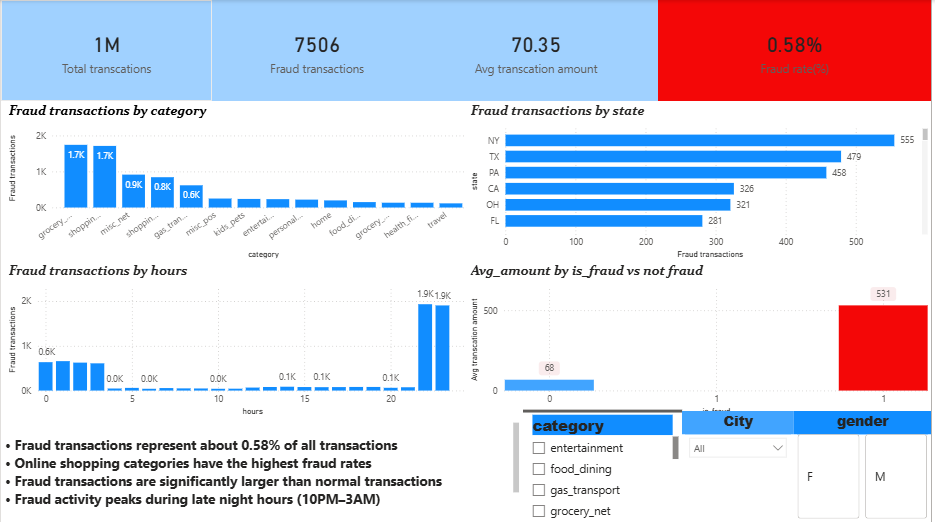

Credit Card Fraud Detection Analysis

Project Overview

This project analyzes credit card transaction data to identify fraud patterns and understand the characteristics of fraudulent transactions. The goal is to explore transaction behavior, detect high-risk categories and locations, and build a dashboard that helps monitor fraud activity.

Using SQL, Python (Pandas), and Power BI, the project demonstrates how data analysts transform raw financial transaction data into actionable insights that can help businesses detect and prevent fraudulent activity.

Tools & Technologies
SQL (DuckDB / SQL)
Python (Pandas)
Data Cleaning & EDA
Power BI
Dataset

The dataset contains credit card transactions with details such as:

Transaction time

Merchant

Transaction category

Transaction amount

Customer location

Merchant location

Fraud label

Target variable:

is_fraud

Values:

0 → Legitimate transaction
1 → Fraudulent transaction

Business Questions Answered

How many total transactions are in the dataset?

What percentage of transactions are fraudulent?

What is the total amount lost to fraud?

What merchant categories have the highest fraud rates?

Which states show the highest fraud activity?

At what time of day do most fraudulent transactions occur?

Do fraud transactions occur far from the customer's location?

Data Analysis Workflow

The project follows the typical data analyst workflow:

Data Loading
Data Cleaning
Exploratory Data Analysis
SQL Aggregation & Business Queries
Fraud Pattern Identification
Power BI Dashboard Visualization
Key Insights

Fraud transactions represent a small percentage of total transactions, but the financial impact is significant.

Online shopping categories show higher fraud rates compared to physical purchases.

Fraudulent transactions tend to occur more frequently during late-night hours.

Certain states show higher fraud occurrence, indicating possible geographic risk areas.

Fraud transactions sometimes occur far from the customer's location, suggesting possible card theft or hacking.

Dashboard Features

The interactive Power BI dashboard includes:

Total Transactions KPI
Total Fraud Transactions
Fraud Rate
Fraud Amount Analysis
Fraud by Category
Fraud by State
Fraud by Time of Day
Transaction Distance Analysis

Interactive filters allow exploration by:

State
Merchant Category
Transaction Time
Fraud Status
Dashboard Preview

Skills Demonstrated
Data Cleaning using Pandas
SQL Query Writing
Fraud Pattern Analysis
KPI Development
Data Visualization
Dashboard Design
Analytical Thinking
Project Structure
credit-card-fraud-analysis
│
├── data
│   └── sample_dataset.csv
│
├── sql
│   └── fraud_analysis_queries.sql
│
│
├── dashboard
│   └── fraud_dashboard.pbix
│
├── images
│   └── dashboard_preview.png
│
└── README.md
Why This Project

Credit card fraud causes billions of dollars in losses each year. This project demonstrates how data analysis techniques can help identify fraud patterns and support financial institutions in building better fraud monitoring systems.
